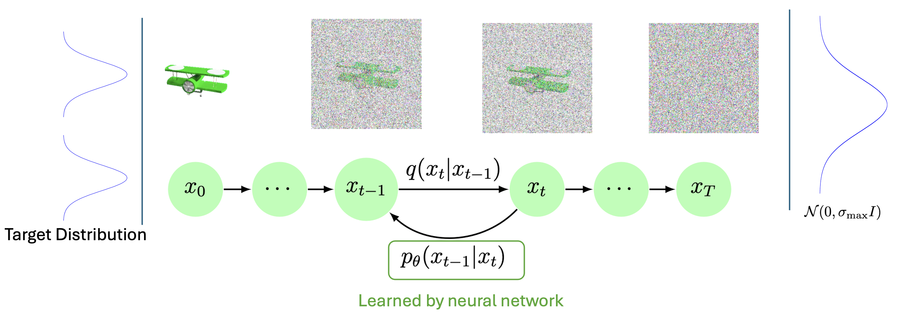
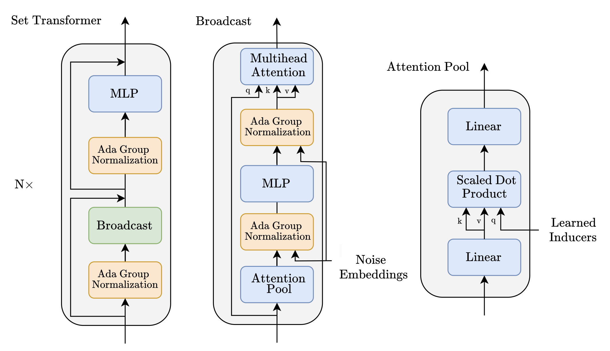
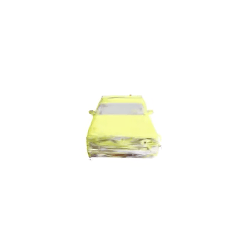

# Image-conditioned Gaussian Splatting Diffusion

 3D Gaussian Splatting is a powerful method for learning 3D structures and enabling high-fidelity novel view synthesis. 

To circumvent long optimization times and the dense accurately posed dataset requirements, in this project, Tyszkiewicz et al.’s point cloud diffusion model [GECCO](https://arxiv.org/abs/2303.05916) is extended to Gaussian Splatting point clouds. This allows generation of Gaussian Splatting scenes either conditionally on an image or unconditionally for a certain class.

Diffusion is the process of adding noise to samples from an unknown distribution with a fixed noise schedule that guarantees transformation of the original sample to a data point from $\mathcal{N}(0,\sigma_{\max} I)$. A neural network $p_\theta$ learns how to undo the noising process, which allows transforming a sample from $\mathcal{N}(0,\sigma_{\max} I)$ to a sample from the target distribution.




## Method

During training, the Gaussian scene is noised based on the noise level t and projected onto a ConvNeXT-tiny-derived feature map. This enhanced point cloud is denoised with the Set Transformer. The loss is calculated by comparing the denoised scene against the ground truth scene and photometrically against a ground truth image.


The denoising backbone is based on Lee et al.'s [Set Transformer](https://arxiv.org/abs/1810.00825) which reduces attention's quadratic complexity to one that is linear in the number of data points w.r.t. the number of Learned Inducers.



## Conditional generation
From the different investigated methods, the Procrustes and SO(3) methods emerged as the most effective. Both methods perform diffusion on the Gaussian parameters in the Euclidean space, but adopt distinct strategies for handling the rotational parts of the Gaussian points. [Procrustes](https://arxiv.org/abs/2103.16317) learns a differentiable mapping from $3\times3$ matrices to rotation matrices and [SO(3)](https://arxiv.org/abs/2312.11707) models the rotations as samples drawn from a rotational distribution, which is the rotational equivalent of the Gaussian normal distribution.

<table>
  <tr>
    <td align="center"><br>Conditioning image for the diffusion process</td>
    <td align="center"><br>Ground truth Gaussian scene</td>
    <td align="center"><br>Diffused scene using Procrustes mapping</td>
    <td align="center"><br>Generated scene using SO(3) diffusion</td>
  </tr>
</table>


  
## Unconditional generation

<table>
  <tr>
    <td align="center"></td>
    <td align="center"></td>
    <td align="center"></td>
    <td align="center"></td>
  </tr>
</table>


## Installation
To train your own models, start with a new conda environment. Then, install [pytorch](https://pytorch.org/get-started/locally/) from source. Next up, install the requirements
```
pip install -r requirements.txt
```
This project uses Christian's [depth renderer](https://git.rwth-aachen.de/christian.schmidt4/gsplat) which needs to be cloned to the directory path/to/this/repository/gecco-torch/src/gecco_torch/. The version used was at commit 6adf1fd874335388cd49e6d4323c55402c856617. 
Then, install the submodule diff-gaussian-rasterization from Gaussian Splatting's [official repo](https://github.com/graphdeco-inria/gaussian-splatting). 
This project uses the Princeton torch implementation of the lie group [lietorch](https://github.com/princeton-vl/lietorch) which can be installed via
```
pip install git+https://github.com/princeton-vl/lietorch.git
```
which needs to be extended as detailed in [this file](modify_lietorch.py).

This repository is structured as a `pip` package which can be installed via 
```
pip install -e path/to/this/repository/gecco-torch
```
 and used as `import gecco_torch`.